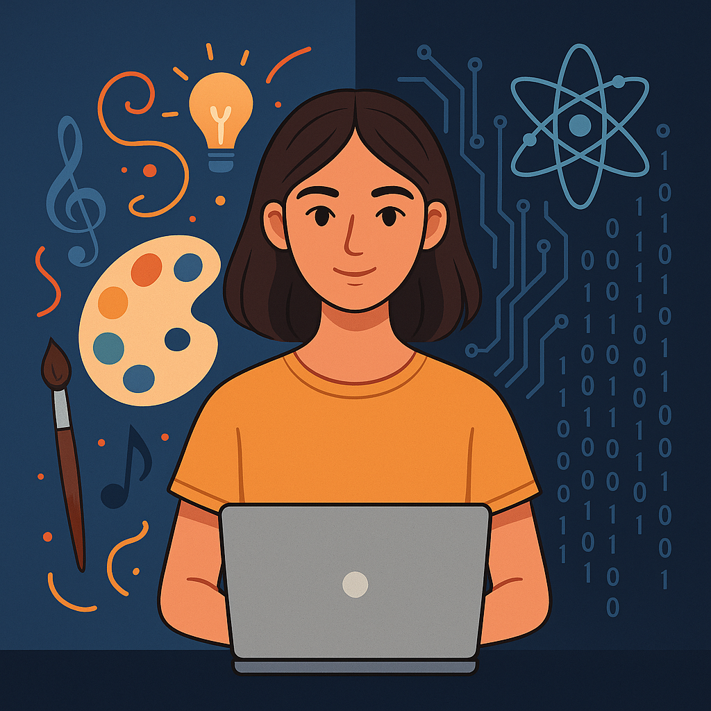

<h1 align="center">Hi 👋, I'm Sharon Zachariah</h1>
<h3 align="center">Engineering Undergraduate | Machine Learning Enthusiast | Creative Technologist</h3>

  
  
  

---

### 💡 About Me

🎓 I'm a Computer Science Engineering student at **Dayananda Sagar University**  
🤖 Passionate about **AI/ML**, **data-driven innovation**, and **medical imaging research**  
💬 I love discussing anything related to **Python**, **Machine Learning**, and **real-world AI applications**  
🌱 Currently exploring: **Generative AI**, **Power BI**, **MATLAB Vision**, and **Neuroscience + AI**

---

  

### 🧠 Projects & Research Highlights

| 💼 Project | 💡 Domain | 🧰 Tools |
|-----------|-----------|---------|
| 🎭 Personality & Suicidal Tendency Prediction | Mental Health AI | CNN, Random Forest, Python |
| 🧠 Multiple Sclerosis Detection from MRI | Medical Imaging | U-Net, KNN, SVM, Python |
| 💬 Financial Chatbot | Conversational AI | NLP, Voice Recognition, Multilingual |
| 🎙️ Parkinson’s Detection via Audio | Health AI | Audio ML, Feature Engineering |
| 🦴 Facial Reconstruction from Skull | Computer Vision | OpenCV, Deep Learning |
| 🌈 Color Correction for Color Blindness | Accessibility AI | MATLAB, Image Processing |
| 👁️ Glaucoma Detection | Healthcare Imaging | MATLAB, Vision Toolbox |

---

### 🧰 Tech Stack

#### 👩‍💻 Languages

#### 🧠 ML / AI

#### 📊 Visualization & BI

#### 🛠️ Tools

### 📈 GitHub Stats

  
  

  

📄 Publications
📝 Multiple Sclerosis Detection using ML for Medical Imaging
International Conference on Advancement in Communication & Computing in Technology (INOACC), 2025

🧩 Ongoing Projects & Simulations
🚧 Business Line Project – Automated Ticket Assignment Tool (Nokia)

🛡️ Mastercard Cybersecurity Simulation (Forage)

📊 Tata Group Data Visualization Simulation (Forage)

### 🌐 Languages I Speak

> English | Hindi | Malayalam | Kannada

👀 Profile Visitors

🎉 Let’s Connect & Collaborate!
If you're into AI for healthcare, creative data science, or tech-for-good — let's collaborate and build something meaningful 🚀

